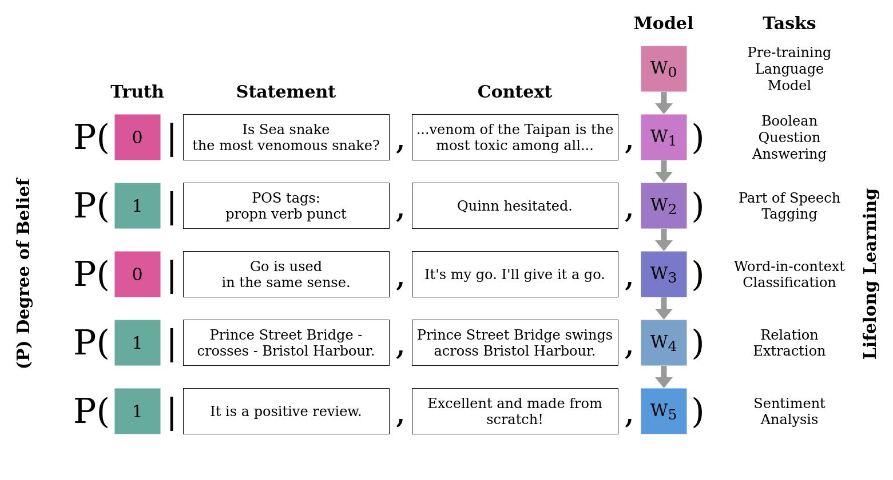

# Lifelong Learning for Language Models



We present an experimental framework 
along with a suite of benchmarks
for lifelong learning using pre-trained language models.
Not only is there is a scarcity of lifelong learning benchmarks 
in the domain of NLP,
but also none of the available benchmarks frame 
the lifelong learning problem in the most general form, 
i.e. having multiple tasks without explicit task identifiers.
To this end, we propose the Degree-of-Belief framework
which can incorporate multiple tasks without giving away explicit task identifiers.
In this framework, the model state its belief in the truth of a statement 
given a context and its past knowledge.
Using this experimental setup,
we design a suite of benchmark data streams 
consisting of multiple tasks, domains and languages
that can be used to investigate, evaluate and experiment with lifelong learning models.

The library is meant to be used for evaluating novel lifelong learning methods
and/or investigating different properties of lifelong learning.
Besides, the library can be easily extended to adapt new tasks into our experimental framework
and design new data streams for additional experiments.

To run a quick demo:
```bash
pip install -r requirements.txt
python main.py
```

The Standard Stream will be generated with the command above.
To save the Standard Stream in the CSV format use the `save_as_csv` flag:
```bash
python main.py --stream=standard --save_as_csv
```
The choice of streams provided in our suite are as follows:
```
standard
long 
forgetting 
intransigence
final_accuracy 
aultc 
multidomain_A 
multidomain_B 
multilingual_A 
multilingual_B
```
To get a `PyTorch` dataloader directly, 
one can call the `get_dataloader()` method on the `Datastream` object.
The `Datastream` class provides more options to customize the stream.
The processing steps to encode a task into our Degree-of-Belief framework
can be found in the `datastreams/transforms.py` source file.


## Citation

```bibtex
@inproceedings{hussain2021towards,
    title={Towards a robust experimental framework and benchmark for lifelong language learning},
    author={Aman Hussain and Nithin Holla and Pushkar Mishra and Helen Yannakoudakis and Ekaterina Shutova},
    booktitle={Thirty-fifth Conference on Neural Information Processing Systems Datasets and Benchmarks Track (Round 1)},
    year={2021},
    url={https://openreview.net/forum?id=yJyIjWyPJgs}
}
```